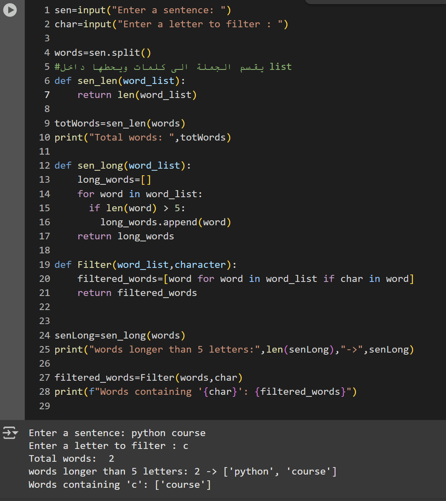

# sentence-analyzer
This Python program allows the user to input a sentence, then select a letter to filter the words in the sentence.
It performs the following tasks:

1-Asks the user to enter a sentence.
2-Asks the user to enter a letter.
3-Filters and prints the words that contain the selected letter.
4-Displays how many words contain the letter.
5-Displays how many words have more than 5 characters.

## Sample Output:

